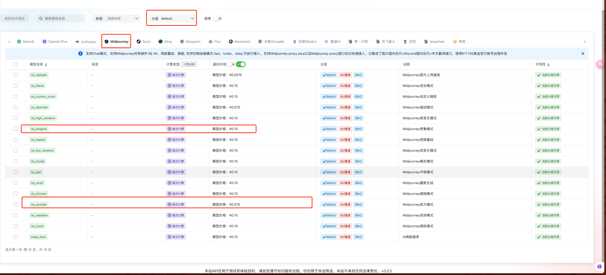
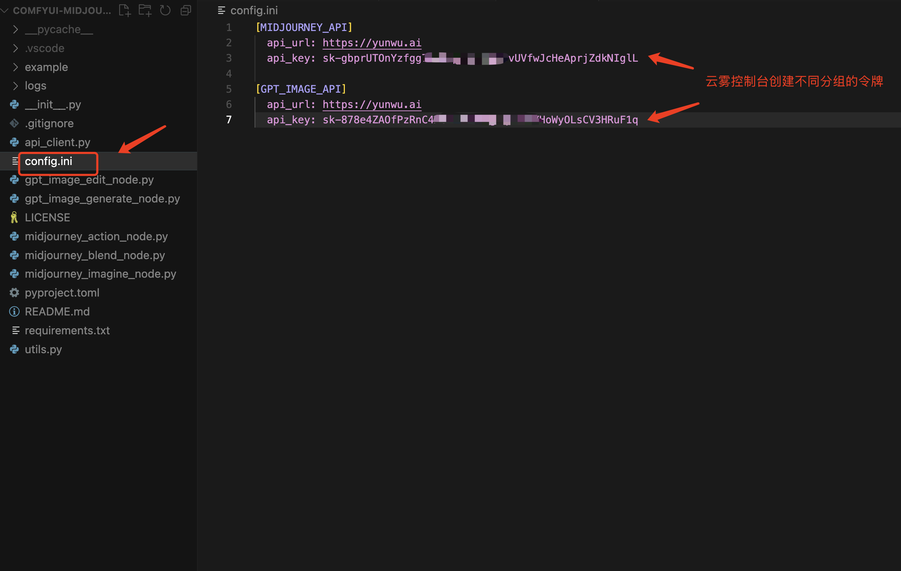
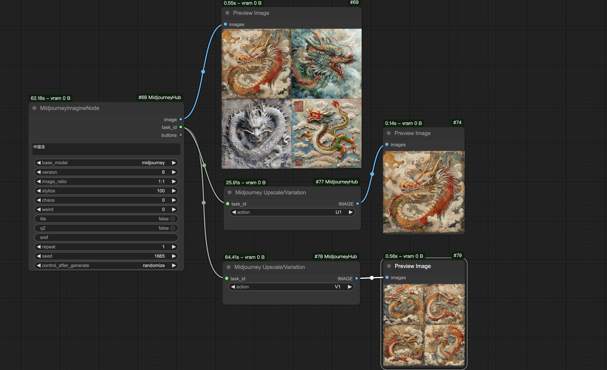
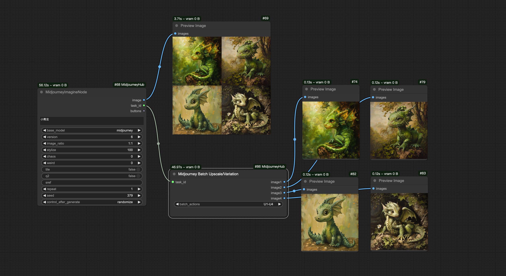
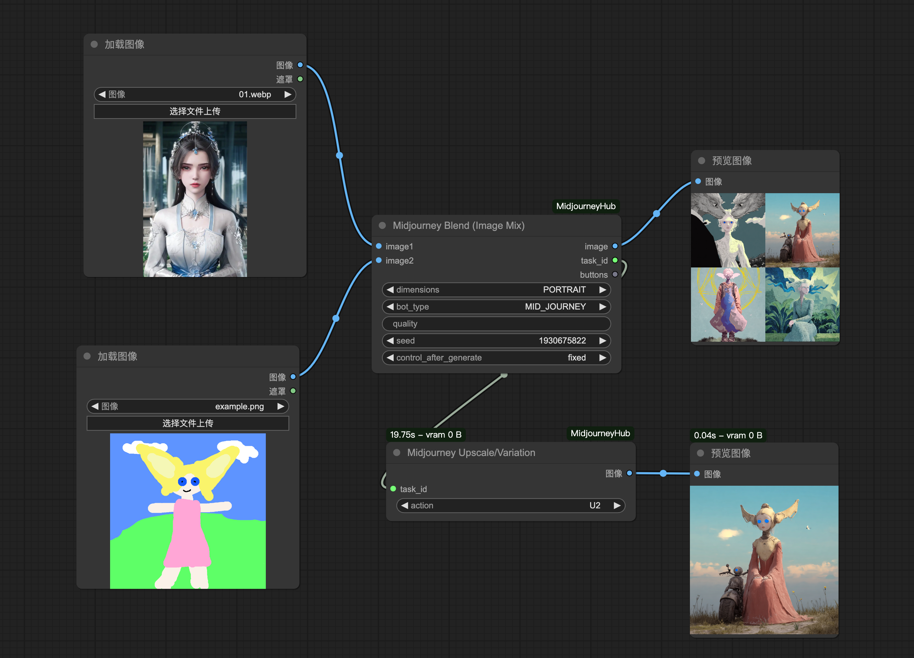
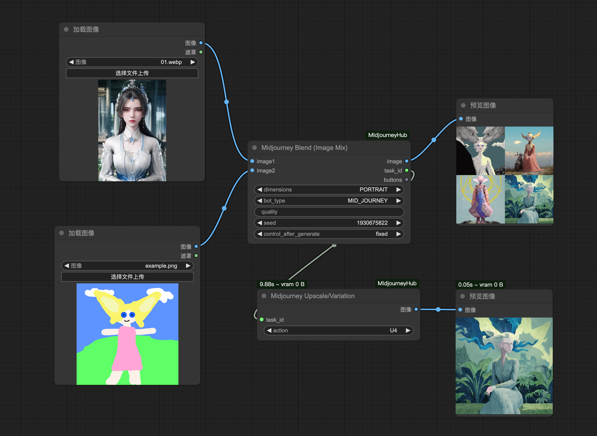
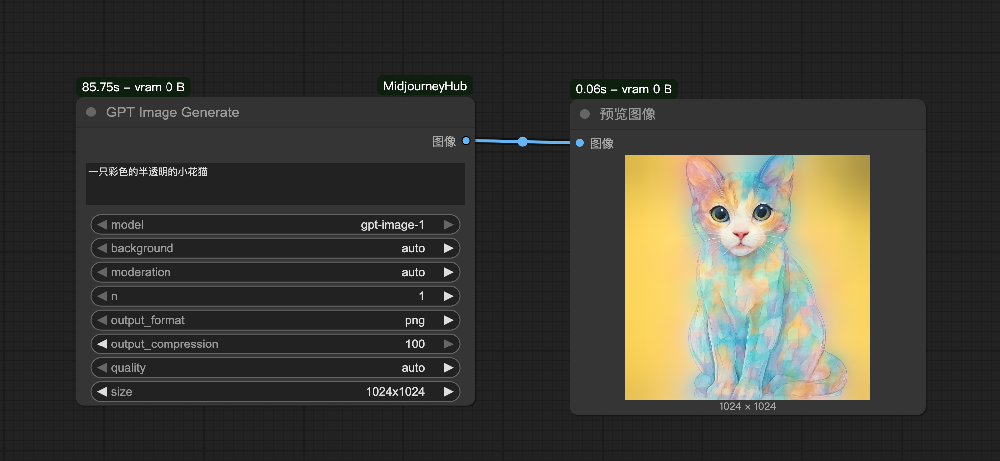
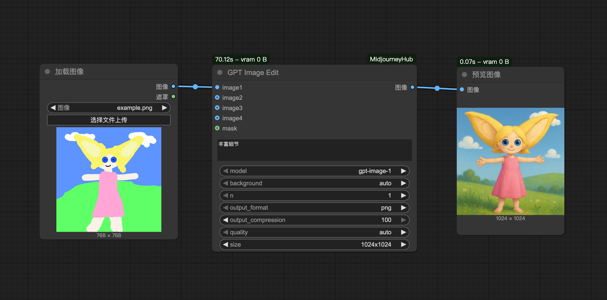

# 简介
该节点可以在 ComfyUI 中使用各种主流商业模型绘图节点，目前后端是使用**云雾 API** 提供的 API 支持。可以通过这个链接进行注册和使用：[https://yunwu.ai/register?aff=ubgH](https://yunwu.ai/register?aff=ubgH)

## 更新
* 2025.06.18 新增 openai **[GPT Image Edit]** 节点，使用 Openai 最新的绘图模型 `gpt-image-1` 根据提示词和待修改的图片进行编辑;
* 2025.06.18 新增 openai **[GPT Image Generate]** 节点，使用 Openai 最新的绘图模型 `gpt-image-1` 根据提示词绘图;
* 2025.06.18 新增 midjourney **[Midjourney Blend (Image Mix)]** 节点，可上传两张图进行融合，支持 `seed` 避免缓存;
* 2024.12.13 引入协程的方式改造原始同步方法，通过并发加快创建图片和同步状态的响应尤其是 [Batch Upsale/Variation] 节点;
* 2024.12.10 支持 midjourney **[Midjourney Batch Upscale/Variation]** 节点;
* 2024.12.06 支持 midjourney **[MidjourneyImagineNode] 和 [Midjourney Upscale/Variation]** 节点;

## 当前价格

> 本项目不会产生任何费用，以下费用出自调用云雾 Midjourney API，总结：4格主图（mj_imagine）是 0.15元/张，基于主图放大后的子图(mj_upscale) 0.075元/张; 如果用批节点输出一张主图+四张放大子图，那么总费用是 0.15+0.075*4=0.45元/张，每张是 0.45/4=0.1125元/张（因为主图没啥用，所以不计入费用）

* 云雾价格主页: [https://yunwu.ai/pricing](https://yunwu.ai/pricing)

## 使用方法
### 1. 修改自己的 api_url/api_key

* [注]：因为后端 API 使用的云雾 API，他们可能不定期修改域名（api_url）

### 2. 工作流示例
1. **MidjourneyImagineNode** 节点 + **Midjourney Upscale/Variation** 节点

2. **MidjourneyImagineNode** 节点 + **Midjourney Batch Upscale/Variation** 节点

3. **Midjourney Blend (Image Mix)** 节点（两张图片融合）
    
    示例1:
    

    示例2:
    

4. **GPT Image Generate** 节点生图（openai 最新的 SOTA 生图模型）
    示例:
    

5. **GPT Image Edit** 节点编辑图（openai 最新的 SOTA 生图模型）
    示例:
    

## Troubleshooting
1. 如何创建正确的分组 API 令牌（api_key）? 
使用云雾API时，需要创建对应的 API 令牌（也就是 config.ini 的 api_key），API 令牌还有分组的概念，不同的组能调用模型的范围不同对应的价格也不同（倍率），具体可以通过这个链接查询：https://yunwu.ai/pricing 以 `gpt-image-1` 为例，目前仅支持 `纯AZ`、`官转`、`官转OpenAI`、`优质官转OpenAI`:
    

2. 遇到以下报错信息：“当前分组 纯AZ 下对于模型 gpt-image-1 无可用渠道”。
建议更换倍率更高的组，比如 `官转` 或者 `官转OpenAI`，保证稳定性（花费更多）

3. 如何查看费用使用情况？
使用云雾API时，可以通过【网页控制台】--【日志管理】--【使用日志】入口查看作业消耗的费用和时间等信息:
    

## 特别鸣谢
1. [ComfyUI-MidjourneyNode-leoleexh](https://github.com/leoleelxh/ComfyUI-MidjourneyNode-leoleexh/tree/main) 提供了节点的布局和样式借鉴，感谢作者的贡献！

## 📩 Disclaimer | 免责申明

本工具仅供学习和研究使用，使用本工具所产生的任何后果由用户自行承担。  

This tool is only for learning and research purposes, and any consequences arising from the use of this tool are borne
by the user.

## 💰 Buy Me a Coffee | 请我喝杯咖啡

  <table>
    <tr>
      <td>
         
      </td>
      <td>
         
      </td>
    </tr>
  </table>

